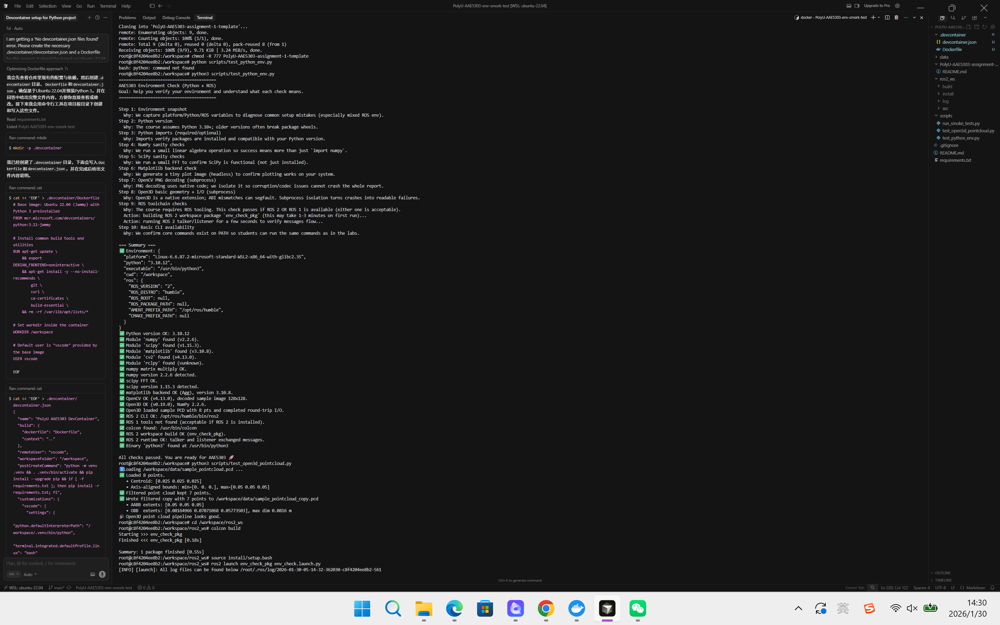
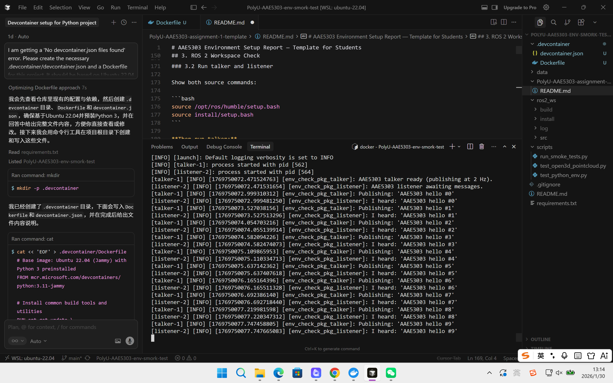

# AAE5303 Environment Setup Report — Template for Students

> **Important:** Follow this structure exactly in your submission README.  
> Your goal is to demonstrate **evidence, process, problem-solving, and reflection** — not only screenshots.

---

## 1. System Information

**Laptop model:**  
Lenovo Yoga 14sIHU 2021 (Model: 82NH)

**CPU / RAM:**  
Intel Core i7-11370H / 16GB RAM

**Host OS:**  
Windows 11 Pro

**Linux/ROS environment type:**  
_[Choose one:]_
- [ ] Dual-boot Ubuntu
- [ ] WSL2 Ubuntu
- [ ] Ubuntu in VM (UTM/VirtualBox/VMware/Parallels)
- [√] Docker container
- [ ] Lab PC
- [ ] Remote Linux server

---

## 2. Python Environment Check

### 2.1 Steps Taken

Describe briefly how you created/activated your Python environment:

**Tool used:**  
system Python (inside Docker container)

**Key commands you ran:**
```bash
docker build -t ros-env -f .devcontainer/Dockerfile .
docker run -it --rm -v "$(pwd):/workspace" -w /workspace ros-env /bin/bash
pip install -r requirements.txt
```

**Any deviations from the default instructions:**  
_[Describe any changes you made, or write "None"]_

### 2.2 Test Results

Run these commands and paste the actual terminal output (not just screenshots):

```bash
python3 scripts/test_python_env.py
```

**Output:**
```
========================================
AAE5303 Environment Check (Python + ROS)
Goal: help you verify your environment and understand what each check means.
========================================

Step 1: Environment snapshot
  Why: We capture platform/Python/ROS variables to diagnose common setup mistakes (especially mixed ROS env).
Step 2: Python version
  Why: The course assumes Python 3.10+; older versions often break package wheels.
Step 3: Python imports (required/optional)
  Why: Imports verify packages are installed and compatible with your Python version.
Step 4: NumPy sanity checks
  Why: We run a small linear algebra operation so success means more than just `import numpy`.
Step 5: SciPy sanity checks
  Why: We run a small FFT to confirm SciPy is functional (not just installed).
Step 6: Matplotlib backend check
  Why: We generate a tiny plot image (headless) to confirm plotting works on your system.
Step 7: OpenCV PNG decoding (subprocess)
  Why: PNG decoding uses native code; we isolate it so corruption/codec issues cannot crash the whole report.
Step 8: Open3D basic geometry + I/O (subprocess)
  Why: Open3D is a native extension; ABI mismatches can segfault. Subprocess isolation turns crashes into readable failures.
Step 9: ROS toolchain checks
  Why: The course requires ROS tooling. This check passes if ROS 2 OR ROS 1 is available (either one is acceptable).
  Action: building ROS 2 workspace package `env_check_pkg` (this may take 1-3 minutes on first run)...
  Action: running ROS 2 talker/listener for a few seconds to verify messages flow...
Step 10: Basic CLI availability
  Why: We confirm core commands exist on PATH so students can run the same commands as in the labs.

=== Summary ===
✅ Environment: {
  "platform": "Linux-6.6.87.2-microsoft-standard-WSL2-x86_64-with-glibc2.35",
  "python": "3.10.12",
  "executable": "/usr/bin/python3",
  "cwd": "/workspace",
  "ros": {
    "ROS_VERSION": "2",
    "ROS_DISTRO": "humble",
    "ROS_ROOT": null,
    "ROS_PACKAGE_PATH": null,
    "AMENT_PREFIX_PATH": "/opt/ros/humble",
    "CMAKE_PREFIX_PATH": null
  }
}
✅ Python version OK: 3.10.12
✅ Module 'numpy' found (v2.2.6).
✅ Module 'scipy' found (v1.15.3).
✅ Module 'matplotlib' found (v3.10.8).
✅ Module 'cv2' found (v4.13.0).
✅ Module 'rclpy' found (vunknown).
✅ numpy matrix multiply OK.
✅ numpy version 2.2.6 detected.
✅ scipy FFT OK.
✅ scipy version 1.15.3 detected.
✅ matplotlib backend OK (Agg), version 3.10.8.
✅ OpenCV OK (v4.13.0), decoded sample image 128x128.
✅ Open3D OK (v0.19.0), NumPy 2.2.6.
✅ Open3D loaded sample PCD with 8 pts and completed round-trip I/O.
✅ ROS 2 CLI OK: /opt/ros/humble/bin/ros2
✅ ROS 1 tools not found (acceptable if ROS 2 is installed).
✅ colcon found: /usr/bin/colcon
✅ ROS 2 workspace build OK (env_check_pkg).
✅ ROS 2 runtime OK: talker and listener exchanged messages.
✅ Binary 'python3' found at /usr/bin/python3

All checks passed. You are ready for AAE5303 🚀
```

```bash
python3 scripts/test_open3d_pointcloud.py
```

**Output:**
```
ℹ️ Loading /workspace/data/sample_pointcloud.pcd ...
✅ Loaded 8 points.
   • Centroid: [0.025 0.025 0.025]
   • Axis-aligned bounds: min=[0. 0. 0.], max=[0.05 0.05 0.05]
✅ Filtered point cloud kept 7 points.
✅ Wrote filtered copy with 7 points to /workspace/data/sample_pointcloud_copy.pcd
   • AABB extents: [0.05 0.05 0.05]
   • OBB  extents: [0.08164966 0.07071068 0.05773503], max dim 0.0816 m
🎉 Open3D point cloud pipeline looks good.
```

**Screenshot:**  
_[Include one screenshot showing both tests passing]_



---

## 3. ROS 2 Workspace Check

### 3.1 Build the workspace

Paste the build output summary (final lines only):

```bash
cd /workspace/ros2_ws
colcon build
```

**Expected output:**
```
Summary: 1 package finished [x.xx s]
```

**Your actual output:**
```
Summary: 1 package finished [0.55s]
```

### 3.2 Run talker and listener

Show both source commands:

```bash
source /opt/ros/humble/setup.bash
source install/setup.bash
```

**Then run talker:**
```bash
ros2 run env_check_pkg talker.py
```

**Output (3–4 lines):**
```
[talker-1] [INFO] [1769750072.999310312] [env_check_pkg_talker]: Publishing: 'AAE5303 hello #0'
[talker-1] [INFO] [1769750073.527038156] [env_check_pkg_talker]: Publishing: 'AAE5303 hello #1'
[talker-1] [INFO] [1769750074.054703216] [env_check_pkg_talker]: Publishing: 'AAE5303 hello #2'
[talker-1] [INFO] [1769750074.582094226] [env_check_pkg_talker]: Publishing: 'AAE5303 hello #3'
```

**Run listener:**
```bash
ros2 run env_check_pkg listener.py
```

**Output (3–4 lines):**
```
[listener-2] [INFO] [1769750072.999481250] [env_check_pkg_listener]: I heard: 'AAE5303 hello #0'
[listener-2] [INFO] [1769750073.527513296] [env_check_pkg_listener]: I heard: 'AAE5303 hello #1'
[listener-2] [INFO] [1769750074.055139914] [env_check_pkg_listener]: I heard: 'AAE5303 hello #2'
[listener-2] [INFO] [1769750074.582474073] [env_check_pkg_listener]: I heard: 'AAE5303 hello #3'
```

**Alternative (using launch file):**
```bash
ros2 launch env_check_pkg env_check.launch.py
```

**Screenshot:**  
_[Include one screenshot showing talker + listener running]_



---

## 4. Problems Encountered and How I Solved Them

> **Note:** Write 2–3 issues, even if small. This section is crucial — it demonstrates understanding and problem-solving.

### Issue 1: Failed to install Cursor Server (Connection Timeout)

**Cause / diagnosis:**  
The automatic "Reopen in Container" feature failed because the IDE server installation script timed out due to network instability.

**Fix:**  
Switched to a manual Docker workflow to bypass the server installation.

```bash
docker build -t ros-env -f .devcontainer/Dockerfile .
docker run -it --rm -v "$(pwd):/workspace" -w /workspace ros-env /bin/bash
```

**Reference:**  
AI assistant

---

### Issue 2: Missing dependencies in base image

**Cause / diagnosis:**  
The original Dockerfile used python:3.11 as the base image, which lacked necessary system libraries for ROS 2, causing build failures.

**Fix:**  
Updated the Dockerfile to use the official ROS 2 image.

```bash
dockerfile:
# Changed FROM python:3.11 to:
FROM osrf/ros:humble-desktop
```

**Reference:**  
AI assistant

---

### Issue 3 (Optional): [Title]

**Cause / diagnosis:**  
_[Explain what you think caused it]_

**Fix:**  
_[The exact command/config change you used to solve it]_

```bash
[Your fix command/code here]
```

**Reference:**  
_[Official ROS docs? StackOverflow? AI assistant? Something else?]_

---

## 5. Use of Generative AI (Required)

Choose one of the issues above and document how you used AI to solve it.

> **Goal:** Show critical use of AI, not blind copying.

### 5.1 Exact prompt you asked

**Your prompt:**
```
I keep getting 'Failed to install Cursor server' errors when trying to reopen in container. I suspect network issues. How can I run the assignment without relying on the auto-connection?
```

### 5.2 Key helpful part of the AI's answer

**AI's response (relevant part only):**
```
AI first provided three suggested measures:
1. ‘Reload the window’
2. Return to the terminal and enter ‘docker rm -f $(docker ps -aq)’ to force deletion, then re-enter ‘Dev Containers: Rebuild Container’
3. Disable the VPN or restart for a bit of luck
Should all three prove ineffective, you can use 'Manual Mode'. Don't rely on the Cursor Server. Instead, use the terminal to manually build and run the Docker container using `docker run -it -v ...`. This bypasses the plugin download entirely.
```

### 5.3 What you changed or ignored and why

Explain briefly:
- Did the AI recommend something unsafe?
- Did you modify its solution?
- Did you double-check with official docs?

**Your explanation:**  
The AI didn't recommend something unsafe. The AI initially suggested using the original Dockerfile. I modified this advice by combining it with the osrf/ros:humble-desktop image because I realized I needed a full ROS 2 environment, not just Python.

### 5.4 Final solution you applied

Show the exact command or file edit that fixed the problem:

```bash
docker run -it --rm -v "$(pwd):/workspace" -w /workspace ros-env /bin/bash
```

**Why this worked:**  
Eliminated reliance on the cursor server, opting instead for manual build and execution of Docker containers where testing requirements could be met.

---

## 6. Reflection (3–5 sentences)

Short but thoughtful:

- What did you learn about configuring robotics environments?
- What surprised you?
- What would you do differently next time (backup, partitioning, reading error logs, asking better AI questions)?
- How confident do you feel about debugging ROS/Python issues now?

**Your reflection:**

I found that the "Reopen in Container" feature is convenient, but it relies heavily on a stable network connection. By switching to manual Docker commands (like docker build and docker run), I got a much clearer understanding of how containers mount volumes. I was also surprised to find that simply changing the base image to osrf/ros:humble-desktop fixed almost all dependency problems right away.

---

## 7. Declaration

✅ **I confirm that I performed this setup myself and all screenshots/logs reflect my own environment.**

**Name:**  
YANG Yuxin

**Student ID:**  
25064265g

**Date:**  
30 Jan 2026

---

## Submission Checklist

Before submitting, ensure you have:

- [√] Filled in all system information
- [√] Included actual terminal outputs (not just screenshots)
- [√] Provided at least 2 screenshots (Python tests + ROS talker/listener)
- [√] Documented 2–3 real problems with solutions
- [√] Completed the AI usage section with exact prompts
- [√] Written a thoughtful reflection (3–5 sentences)
- [√] Signed the declaration

---

**End of Report**
